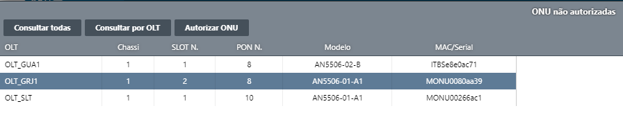
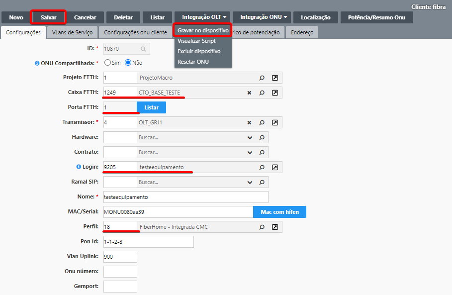

# Subir equipamento

Equipamento = Modem/roteador
1. Ligamos o equipamento na energia, e conectamos o cordão óptico.
2. Restauramos o equipamento para a sua configuração de fábrica.
3. Acessamos o equipamento pelo wifi, e configuramos o PPPoE do "testeequipamento"
4. No IXC, na barra leteral esquerda, clicamos em Provedor -> Autorizar ONUs
5. Ao clicar, irá aparecer uma lista com as ONUs disponiveis para autorizar.  

**Caso não esteja aparecendo para liberar, verifique se o equipamento já não está autorizado pesquisando pelo final (últimos 4 digitos) do seu endereço MAC no UNM2000.**

6. Após selecionar o equipamento correto na lista, clique em Autorizar ONU.
7. Precisamos preencher os seguintes campos:  
**Caixa FTTH**: 1249 - CTO_BASE_TESTE  
**Porta FTTH**: *Selecione uma porta que esteja disponivel*  
**Login**: *PPPoE de um dos "testeequipamento"*  
**Perfil**: Ou será o perfil 1, ou 18.   
<table>
  <tr>
    <th>Perfil</th>
    <th>Caso de uso</th>
  </tr>
  <tr>
    <td>1</td>
    <td>Usado quando o equipamento está em bridge, ou seja, possui um modem separado do roteador.</td>
  </tr>
  <tr>
    <td>18</td>
    <td>Usado quando o equipamento é integrado, ou seja, faz a função tanto do modem, quanto do roteador.</td>
  </tr>
</table>
8. Após preencher todos os campos necessários, clicamos em salvar, e depois Integração OLT -> Gravar no dispositivo.   

