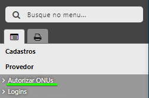

# Subir equipamento

Equipamento = Modem/roteador
1. Ligamos o equipamento na energia, e conectamos o cordão óptico.
2. Restauramos o equipamento para a sua configuração de fábrica.
3. Acessamos o equipamento pelo wi-fi, e configuramos o PPPoE do "testeequipamento".
4. No IXC, na barra lateral esquerda, clicamos em Provedor -> Autorizar ONUs.  
